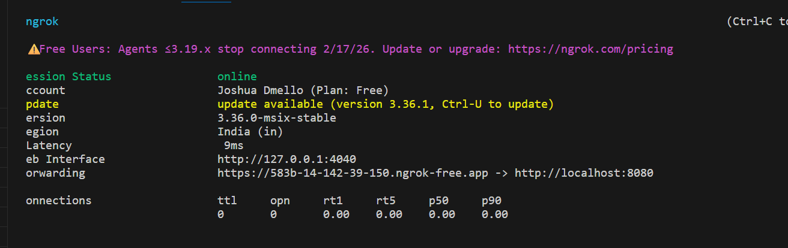
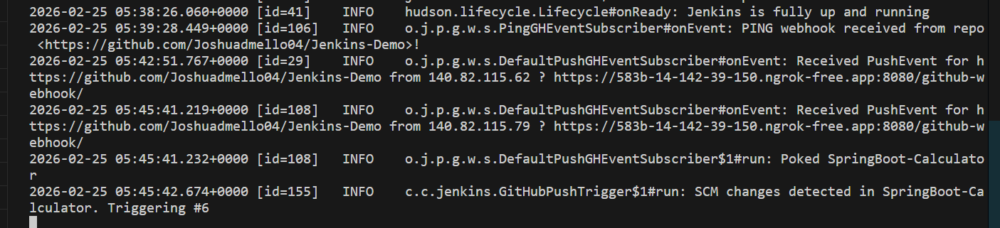
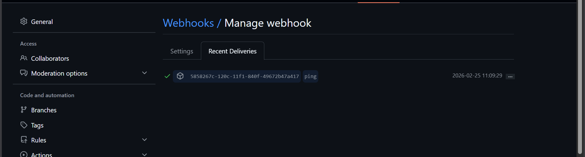
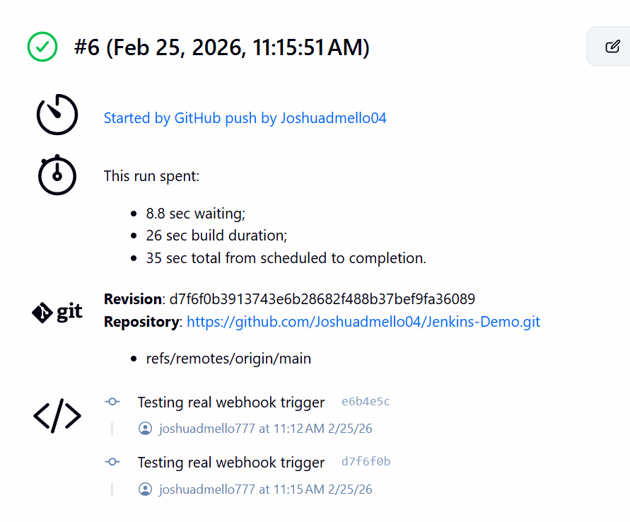

# 🚀 Jenkins CI Pipeline using GitHub Webhooks + ngrok (No Poll SCM)

## 📌 Project Overview

This project demonstrates Continuous Integration (CI) using:

-   Spring Boot Calculator Application
-   GitHub Repository
-   Jenkins Pipeline
-   GitHub Webhooks
-   ngrok (to expose local Jenkins)

Polling SCM was NOT used. Instead, real-time webhook triggering was
implemented.

------------------------------------------------------------------------

# 1️⃣ Create Spring Boot Calculator Project

## Steps:

1.  Create Spring Boot project (Spring Initializr)
2.  Add dependencies:
    -   Spring Web
    -   Spring Boot Test
3.  Create Calculator Controller:

``` java
@RestController
@RequestMapping("/calc")
public class CalculatorController {

    @GetMapping("/add")
    public int add(@RequestParam int a, @RequestParam int b) {
        return a + b;
    }
}
```

Test URL: http://localhost:8080/calc/add?a=10&b=5

------------------------------------------------------------------------

# 2️⃣ Initialize Git & Push to GitHub

``` bash
git init
git add .
git commit -m "Initial commit"
git branch -M main
git remote add origin https://github.com/<username>/Jenkins-Demo.git
git push -u origin main
```

------------------------------------------------------------------------

# 3️⃣ Install & Configure Jenkins

``` bash
java -jar jenkins.war
```

Open: http://localhost:8080

### Jenkins SCM Configuration


------------------------------------------------------------------------

# 4️⃣ Configure Global Tools in Jenkins

Manage Jenkins → Global Tool Configuration

Add: - JDK → JAVA_HOME - Maven → MAVEN_HOME

------------------------------------------------------------------------

# 5️⃣ Create Jenkins Pipeline Job

New Item → Pipeline → Pipeline script from SCM → Git

------------------------------------------------------------------------

# 6️⃣ Jenkinsfile

``` groovy
pipeline {
    agent any

    tools {
        jdk 'JAVA_HOME'
        maven 'MAVEN_HOME'
    }

    stages {

        stage('Build') {
            steps {
                echo 'Building project...'
                bat 'mvn clean install'
            }
        }

        stage('Run') {
            steps {
                echo 'Running jar in background...'
                bat 'start /B java -jar target\\jenkins-calc-0.0.1-SNAPSHOT.jar'
            }
        }
    }
}
```

------------------------------------------------------------------------

# 7️⃣ Setup ngrok

``` bash
ngrok config add-authtoken YOUR_TOKEN
ngrok http 8080
```

### ngrok Running



------------------------------------------------------------------------

# 8️⃣ Configure GitHub Webhook

GitHub → Settings → Webhooks → Add Webhook

Payload URL: https://your-ngrok-url/github-webhook/

### GitHub Webhook Trigger


------------------------------------------------------------------------

# 9️⃣ Enable Webhook Trigger in Jenkins

Enable:

GitHub hook trigger for GITScm polling

### Jenkins Trigger Enabled



------------------------------------------------------------------------

# 🔟 Webhook Success Confirmation

### Webhook Delivery Success



------------------------------------------------------------------------

# ✅ Build Success Output

### Jenkins Build Successful



------------------------------------------------------------------------

# 🔁 Final Workflow

Git Push\
↓\
GitHub Webhook\
↓\
ngrok Tunnel\
↓\
Jenkins\
↓\
Pipeline Executes\
↓\
Maven Build + Tests\
↓\
Build SUCCESS / FAILURE

------------------------------------------------------------------------

# 🎯 What Was Implemented

✔ Continuous Integration (CI)\
✔ Webhook-based triggering (No Poll SCM)\
✔ Real-time pipeline execution\
✔ Automated Build & Testing\
✔ Background application deployment

------------------------------------------------------------------------

# 🧠 Viva Explanation

"I implemented Continuous Integration using Jenkins and GitHub webhooks.
Since Jenkins was running locally, I exposed it using ngrok. On every
Git push, GitHub sends a webhook to Jenkins, which automatically builds
and tests the project."

------------------------------------------------------------------------

# 🔥 Conclusion

This setup demonstrates real-time webhook-based CI using:

Git + GitHub + Jenkins + ngrok + Maven + Spring Boot.

Fully automated integration pipeline.
